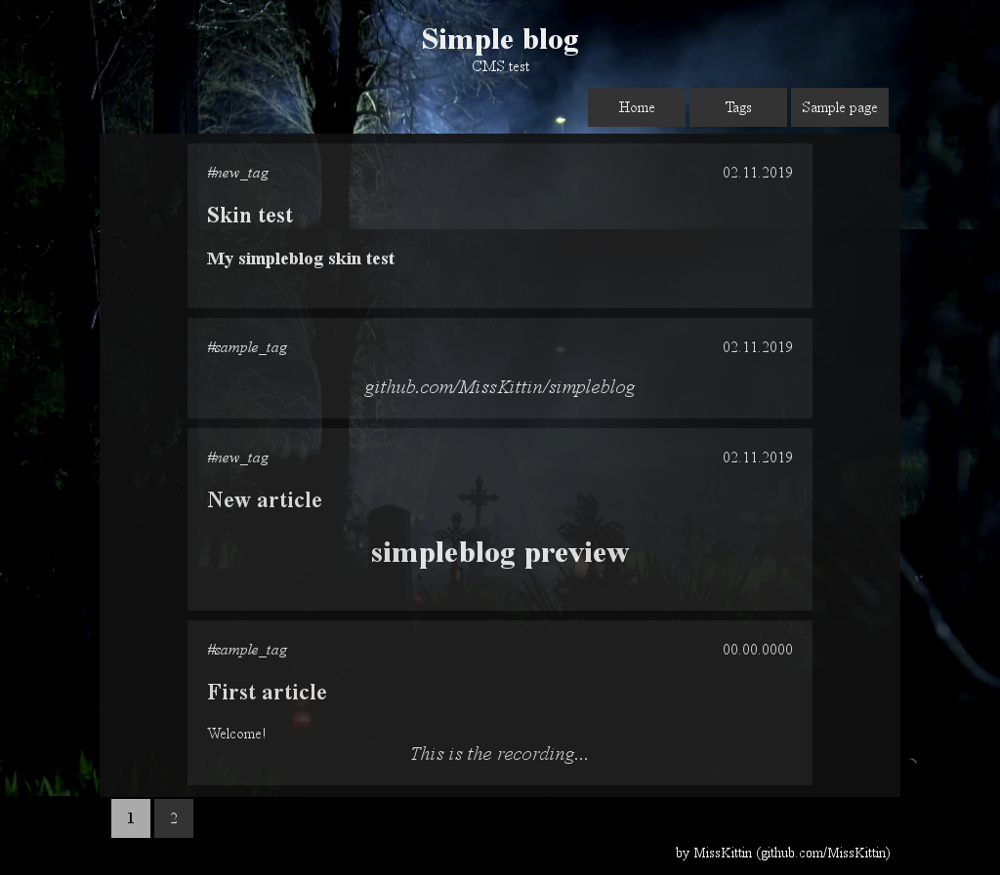

# Simpleblog v2.2
I wanted a wordpress on my linux server, but without javascript. So I wrote <del>simple script</del> CMS, that render my short posts.

No cookies(\*\*), no sessions(\*\*) and conventional database, with tags, custom pages and hiding articles.  
\*\* cookies and sessions for login, javascript in TabManager.js

If you know the basics of PHP, HTML and CSS, the Simpleblog is for you :)  
But first read manual.

# Manual
[Here](HOWTO.md)

# admin panel
* requires PHP >= 5.5.0
* default login and password is `simpleblog`
* admin/disabled.php completely disables the panel - remove this file
* online backup: [here](patches/zip.lib)

# Additional cron tasks
* `requireHTTPS.php`

# Additional functions
* `checkDate.php` -> apply eg custom style beetwen start and end date
* `checkEaster.php` -> checkDate for Easter  
  calculates the first day of Easter and the end date by adding n days to the first day

# Patches
[Here](patches)

# skurkawudka czorno
skin of my blog with `allsaints` customization (only for me :-)  
